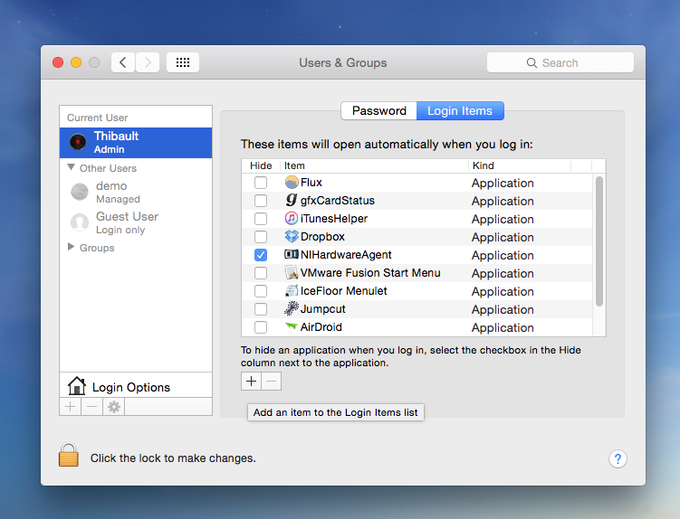
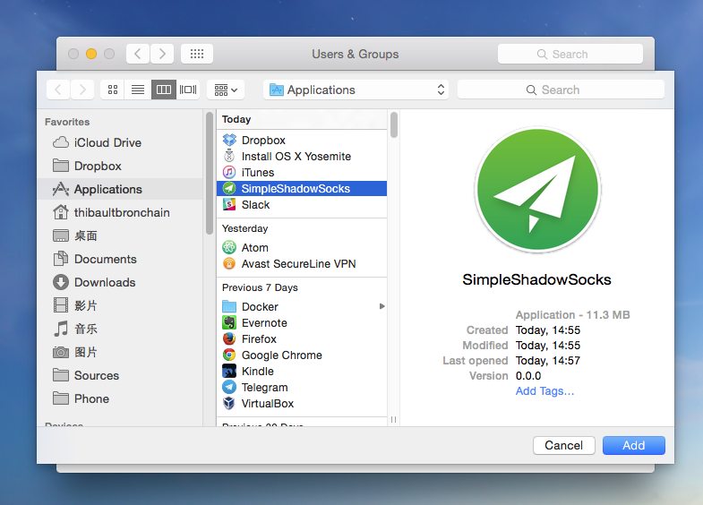

# Simple Shadow Socks Install Instructions

## Installation

- Run `ss-setup.command` to setup the requirements
- Run `SimpleShadowSocks.pkg` to setup the application

Application will be deployed under "Applications" directory.

## First launch

- Go to `Applications`, then run `SimpleShadowSocks`. You can also search `SimpleShadowSocks` directly from the finder

- Change the IP and Password to your server's credentials

## Recommended

- Save the icon to the Dock: Right click on `SimpleShadowSocks` icon in the Dock, then "Options", then "Keep in Dock".

- Add to startup: Go to "System Preferences" > "Users & Groups" > "Login Items". Then, click on the "+" icon, and add "SimpleShadowSocks".

